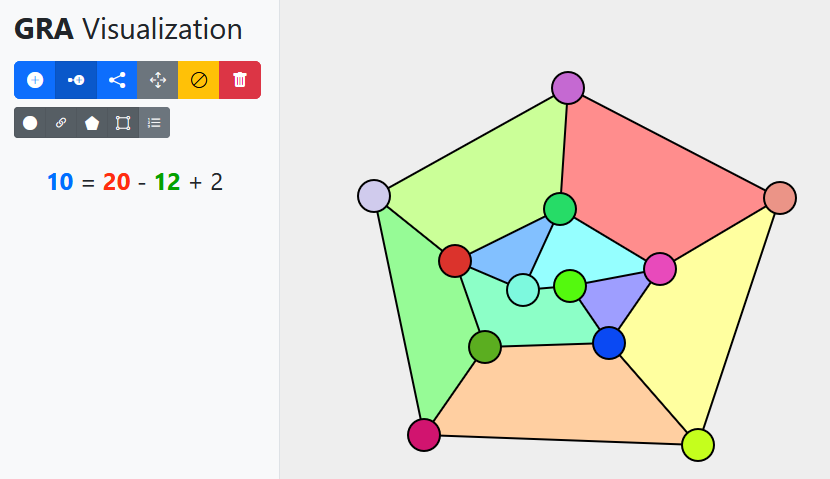
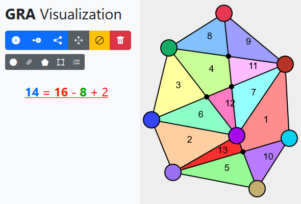
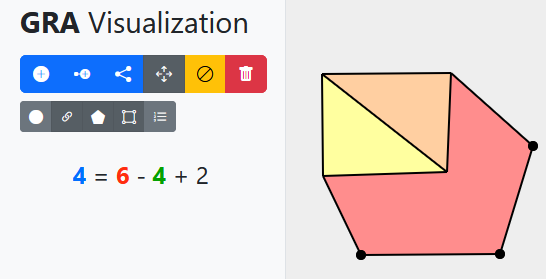

# Visualisierungstool für Graphentheorie

... an der [Hochschule Mannheim](https://www.hs-mannheim.de).
Live-Version: https://yanwittmann.github.io/hsma-gra-graph-visualization

## Features

- Visueller Editor für Graphen
    - Ecken hinzufügen / verschieben / löschen
    - Ecken mit Kanten verbinden
    - Unterstützt Umleitungskanten (um gebogene Kanten zu erstellen)
    - Snapping mit shift-Taste
- Erkennen / Anzeigen von Polygonen
- Unterschiedliche Displaymodi (siehe Beispiele unten)
- Automatisches Anwenden der Eulerschen Polyederformel

Die Anwendung ist nur für Demo-Zwecke gedacht, bis etwa 25 Kanten läuft sie noch akzeptabel schnell, danach wird sie
zu langsam für einen normalen Gebrauch.

## Related Work / Literature

- https://www.inesc-id.pt/ficheiros/publicacoes/936.pdf
- https://gis.stackexchange.com/questions/5132/lines-to-polygons
- https://stackoverflow.com/questions/38336698/polygon-detection-from-a-set-of-lines
- https://github.com/realuptime/PolyDetector/blob/main/PolyDetector.cpp

#### Debug

- `v` blendet Informationen über die Ecken ein
- `e` blendet Informationen über die Kanten ein
